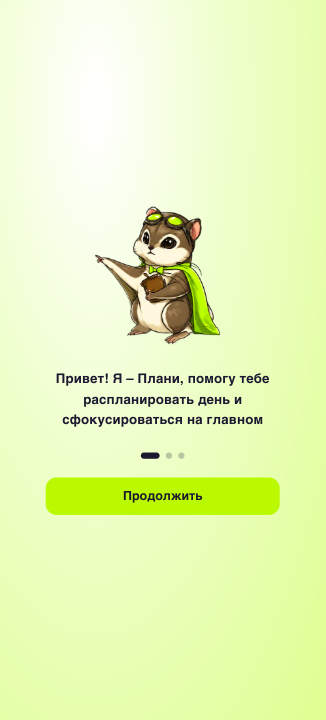
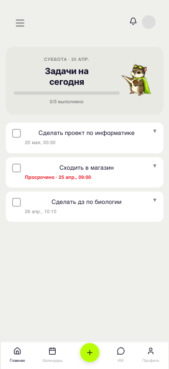
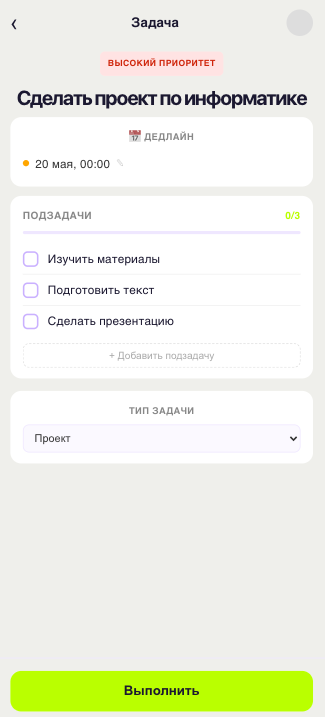
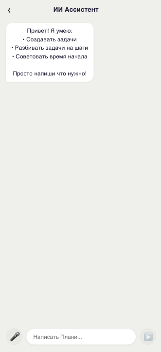

# view-life — Умный трекер учебных задач

> Хакатон WATA, трек «Школьники»

**view-life** — мобильное веб-приложение для школьников, которое помогает управлять учебными задачами с помощью ИИ. Маскот проекта — **Плани**.

---

## Ключевые решения

### ИИ-агент, а не просто ассистент

Большинство учебных приложений используют LLM как чат-бот: задал вопрос — получил ответ. Мы пошли дальше.

В view-life встроен **ИИ-агент** с маршрутизацией намерений: система сама определяет, что хочет пользователь — создать задачу, разбить существующую на шаги, или узнать оптимальное время начала — и вызывает нужную функцию. Каждый intent обрабатывается отдельным специализированным промтом на русском языке. Агент работает **локально через Ollama** (llama3.1:8b) — пользовательские данные не покидают устройство.

### Интеграция с Дневник.ру

Дневник.ру не предоставляет открытого OAuth2 для сторонних разработчиков — партнёрский доступ требует отдельной регистрации. Мы исследовали публичные библиотеки (`pydnevnikruapi`), нашли рабочие эндпоинты и реализовали интеграцию через пользовательский access-токен: ученик один раз авторизуется через DevTools и синхронизирует домашние задания в один клик.

### Многоуровневая система ролей

Три роли с разными правами доступа к одним и тем же данным — нетривиальная задача на уровне модели и API:

- **Ученик** работает со своими задачами, привязывает учителя
- **Учитель** видит только задачи, которые сам выдал, создаёт задания конкретным ученикам из своего списка
- **Родитель** видит задачи ребёнка (кроме личных), добавляет ему задачи

Связи хранятся в одной таблице `User` через FK (`linked_student`, `linked_teacher`) с разной логикой на уровне queryset'ов и прав доступа. Один и тот же API возвращает разные данные в зависимости от роли запрашивающего.

---

## Возможности

- **ИИ-агент** — создаёт задачи из текста или голоса, разбивает на подзадачи, рекомендует оптимальное время начала
- **Умный трекер** — список задач с приоритетами, дедлайнами, статусами и прогрессом выполнения
- **Подзадачи** — чекбоксы с прогресс-баром, добавление вручную или через ИИ
- **Календарь** — просмотр задач по дням с месячным видом
- **Классификация** — автоматическое определение типа (ДЗ / экзамен / проект / личное)
- **Интеграция с Дневник.ру** — синхронизация домашних заданий
- **Голосовой ввод** — Web Speech API (Chrome)
- **Роли** — ученик, учитель, родитель

---

## Роли

| Роль | Возможности |
|------|-------------|
| Ученик | Создаёт свои задачи, общается с ИИ, привязывает учителя |
| Учитель | Создаёт задачи для своих учеников, видит только выданные задачи |
| Родитель | Привязывает аккаунт ребёнка, видит все его задачи (кроме личных), добавляет задачи ребёнку |

---

## Стек

| Часть | Технологии |
|-------|-----------|
| Backend | Python 3.12, Django 6, Django REST Framework, JWT |
| Frontend | React 18, Vite, axios, react-router-dom, lucide-react |
| ИИ | Ollama (llama3.1:8b), LangChain |
| БД | SQLite |
| Деплой | Docker, Docker Compose, Nginx, Gunicorn |

---

## Структура проекта

```
view-life/
├── backend/
│   ├── config/
│   ├── users/
│   ├── tasks/
│   ├── ai/
│   └── integrations/
├── frontend/
│   ├── src/
│   │   ├── api/
│   │   └── pages/
│   │       ├── OnboardingPage.jsx
│   │       ├── DashboardPage.jsx
│   │       ├── TaskDetailPage.jsx
│   │       ├── CreateTaskPage.jsx
│   │       ├── CalendarPage.jsx
│   │       ├── AIChatPage.jsx
│   │       └── ProfilePage.jsx
│   └── nginx.conf
├── docker-compose.yml
└── README.md
```

---

## Запуск через Docker

git clone https://github.com/F-4-K-E/view-life.git
cd view-life
docker compose up --build

Приложение: http://localhost

Для ИИ — Ollama на хосте:
ollama pull llama3.1:8b
ollama serve

---

## Запуск локально

Backend:
cd backend
python3 -m venv venv
source venv/bin/activate
pip install -r requirements.txt
python manage.py migrate
python manage.py runserver

Frontend:
cd frontend
npm install
npm run dev

---

## API

POST   /api/users/register/
POST   /api/users/login/
GET    /api/users/me/
POST   /api/users/link-child/
POST   /api/users/link-teacher/
GET    /api/users/my-students/
GET    /api/tasks/
POST   /api/tasks/create/
GET/PATCH/DELETE /api/tasks/<id>/
PATCH  /api/tasks/<id>/status/
GET/POST /api/tasks/<id>/steps/
PATCH  /api/tasks/steps/<id>/toggle/
POST   /api/ai/chat/
POST   /api/ai/create-task/
POST   /api/integrations/dnevnik/connect/
POST   /api/integrations/dnevnik/sync/

---

## Как работает ИИ-агент

1. Пользователь пишет: «Нужно подготовиться к контрольной по физике в пятницу»
2. Агент определяет intent: создать задачу / разбить на шаги / рекомендовать время
3. Задача автоматически классифицируется — тип, приоритет, дедлайн
4. Генерируются подзадачи — конкретные шаги выполнения
5. Рассчитывается рекомендуемое время начала с учётом расписания

Модель работает локально — данные не передаются в облако.

---

## Скриншоты

Скриншоты в папке docs/screenshots/







---

## Команда

Хакатон WATA — трек «Школьники»